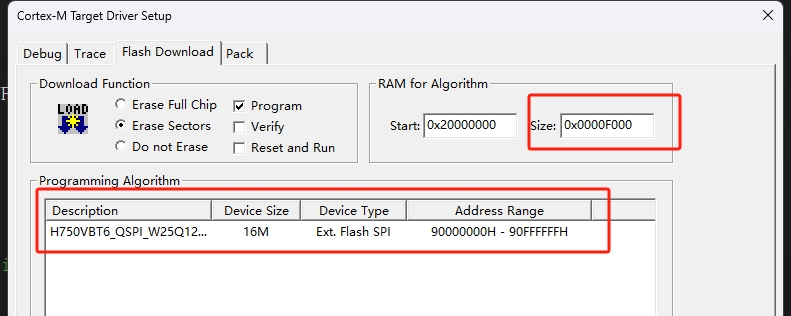
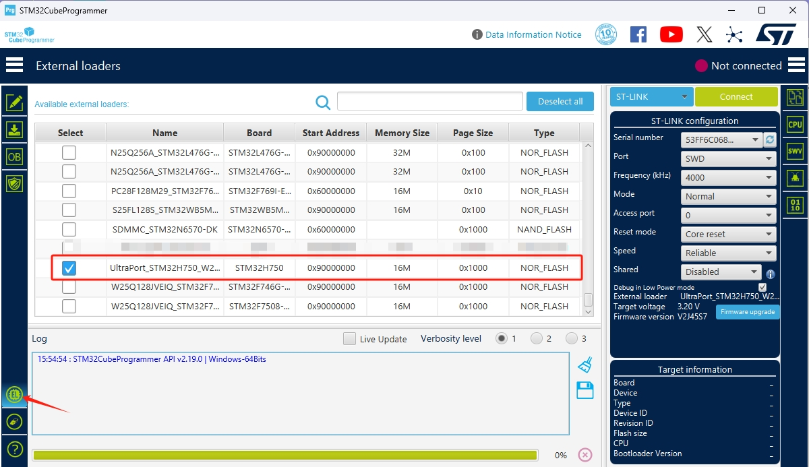

# Ultra_Port_Board
Ultra_Port开发板工程，由于STM32H750的内部Flash大小仅仅为128kb，对于较大的工程需要把代码存放到flash外。Ultra_Port_Board硬件上搭载一个16MB的Flash芯片W25Q128，通过STM32H750的QSPI接口，把代码存放到SPI Flash中。

## BOOTLOADER
bootloader工程，程序的执行入口，用于跳转到用户程序。

## LVGL_MDK_switch
用户程序，这里演示的是一个LVGL开关的示例。

## Keil_FLM下载算法
Keil_FLM下载算法，代码编译生成一个.FLM的文件，与Keil MDK配合使用，用于把用户程序烧录到0x90000000地址。


## STM32CubeProg_stldr下载算法
Keil_FLM下载算法，代码编译生成一个.stldr的文件，与STM32CubeProgrammer配合使用，用于把用户程序烧录到0x90000000地址。
需要把UltraPort_STM32H750_W25Q128.stldr文件放到STM32CubeProgrammer的配置文件目录下

```sh
C:\Program Files\STMicroelectronics\STM32Cube\STM32CubeProgrammer\bin\ExternalLoader
```

